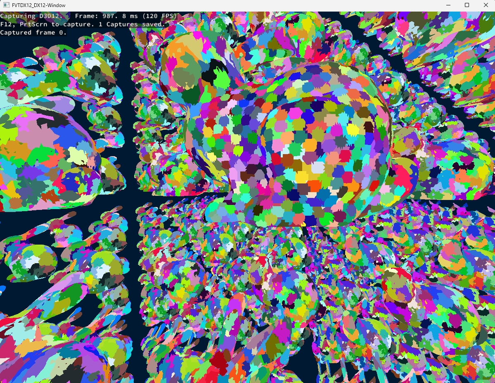
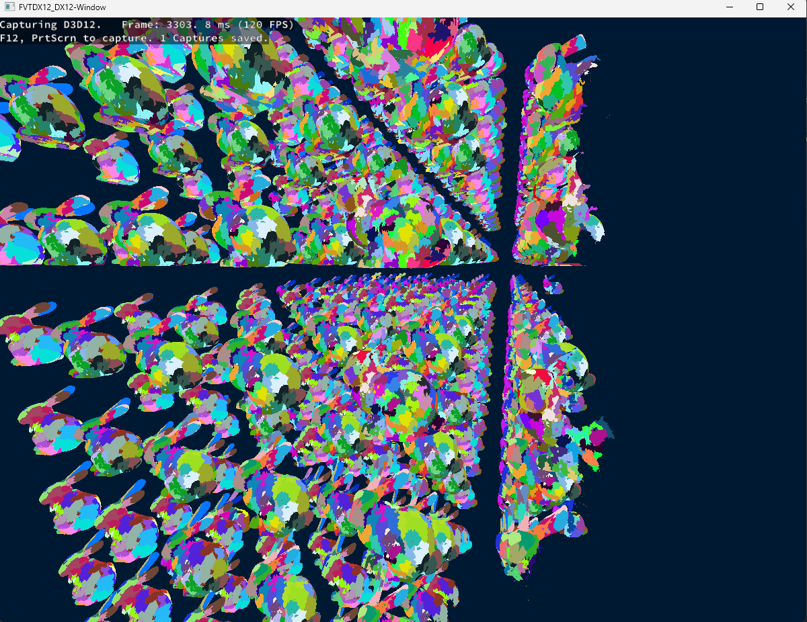

# Nanite-Style Cluster LOD

Initially, this repo was created by one of the teachers from my school (it's a fork from his repo) to be able to switch from Vulkan to DirectX12 with ease.

## Introduction

To challenge myself with mesh shaders, I decided to implement a simple Nanite-style Cluster LOD system in this project. This currently only works with DirectX12 and it's also restricted to one geometry. It also implements some culling within the LOD hierarchy itself, but it doesn't implement any occlusion culling yet (maybe in the future).

Here are 2 screenshots of the current state of the project and what you can expect to see when you run it:
| Hierarchy preview                                  | Hierarchy with culling preview                          |
|-----------------                                   |----------------------	                               |
|  |  |

## Controls
- **WASD** to move the camera.
- **Mouse** to rotate the camera.
- **Left Shift** to increase the camera speed.
- **Space** Freeze the camera in place to better see the culling in action.

## TODO
- Optimize some compute passes that I know are easy to optimize (I'm talking about you, ComputeInit.hlsl xD).
- Integrate all the visualization options in a UI or at least as some hotkeys instead of having to comment/uncomment code to visualize the different buffers.
- Implement some occlusion culling.
- Make a command line arg to load a custom .obj file instead of the hardcoded one.
- Add some more comments in the code to make it easier to understand.
- Try making the task buffer into a ring buffer to save some space (maybe).

## Required components

### CMake
The **CMake build-tools** are used to allow using any compiler and IDE.\
Install the **CMake build-tools** [here](https://cmake.org/download/).

The **CMake integration tools** for your **IDE** are also required to be able to directly open the root directory and work from there.\
\
Ex: Install Visual Studio's **CMake integration tools** from the Visual Studio Installer:\


### Vulkan SDK
In order to link and compile the Vulkan example, the Vulkan SDK is required.\
/!\ When installing the Vulkan SDK, be sure to select the **Shader Toolchain Debug Symbols** to be able to link the GLSL shader compiler library (_libshaderc_combined_d.lib_) in debug:


### DirectX12
The DirectX12 libraries are **already packed with the Windows OS**, therefore, **no SDK installation** is required in order to use DirectX12.\
However, to access the **latest DirectX12 features**, the **Agility SDK** can be installed into the project to override the .dlls from the OS.\
For this project, the Agility SDK **615** is automatically downloaded and installed to make sure everyone has access to **Mesh Shaders**. The Agility SDK also provide additional includes such as:
```cpp
#include <d3dx12/d3dx12.h>
```


## Initialization

Start by **cloning** the **repository**.
```
git clone https://github.com/mrouffet/FromVulkanToDirectX12.git
cd FromVulkanToDirectX12
```

Then init the **submodules** to fetch the **dependencies** using the command:
```
git submodule update --init --recursive
```

Now the project is ready to be open directly from the **root directory** using your IDE in "_CMake mode_".


## Authors

**Maxime "mrouffet" ROUFFET** - main developer (maximerouffet@gmail.com)
**Guillaume "GuilBlack" BLACKBURN** - cluster LOD hierarchy developer (guillaume.blackburn1@gmail.com)